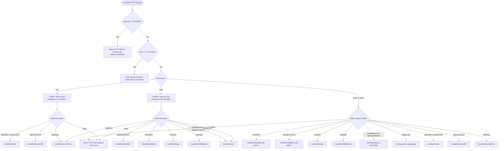

# NextBridge Unified Cloudflare Edge Gateway — Architecture & Backend API Documentation

> **Version:** 3.3.10 (Production)  
> **Runtime Environment:** Cloudflare Workers (V8 Isolates)  
> **Deployment Infrastructure:** 6-Tier Distributed Failover Mesh (`adsbackend01` – `adsbackend06`)  
> **Primary Domains:** `https://nextbridgeapi.adsbackend01.workers.dev` (with fallback accounts `02` through `06`)

---

## 1. Executive Summary & Core Mission

The **NextBridge Unified Cloudflare Edge Gateway** is a high-performance, ultra-low-latency reverse proxy and edge computation engine built on Cloudflare Workers (V8 Isolates). It merges two previously disparate backend systems into a single unified deployment:

1. **NextToppers (NT) Engine (`/nt/...`)**: Real-time folder exploration, live course sync, algorithmic HLS stream construction, automated Bearer token lifecycle management via Firebase RTDB, and a 3-tier fallback PDF resolver with WebCrypto AES-CBC decryption.
2. **Physics Wallah (PW) Engine (`/pw/...`)**: 100% drop-in RPC compatibility for `POST /api/data`, multi-tier lecture URL resolution, dynamic MPD manifest rewriting with CloudFront signature injection, HTTP 206 Range-safe media segment streaming, ClearKey DRM extraction, and CORS-safe PDF resolution.

### Key Architectural Objectives
- **Zero Cold Starts**: Native V8 isolate execution with `<15ms` p99 edge latency across 300+ global Cloudflare edge nodes.
- **Complete CORS Isolation**: Strips restrictive upstream cross-origin headers and injects permissive wildcard headers (`Access-Control-Allow-Origin: *`) across all data, streaming, manifest, and PDF endpoints.
- **Browser-Safe Media Streaming**: Rewrites MPEG-DASH manifests so that media segment requests (which CloudFront natively blocks due to lack of CORS) route back through the worker with full `Range` header passthrough.
- **Failover Redundancy**: Cloned across 6 isolated Cloudflare accounts with automatic client-side round-robin and health failover.

---

## 2. High-Level System Architecture

```mermaid
flowchart TD
    subgraph ClientLayer ["Client Applications"]
        WebApp["Web App (Netlify PWA)"]
        MobileApp["Android Client (Capacitor)"]
        AdminPanel["Admin Panel (React)"]
    end

    subgraph EdgeGateway ["NextBridge Unified Edge Gateway (Cloudflare Workers)"]
        Router{"Main Router & Dispatcher"}
        CORS["CORS Preflight (OPTIONS 204)"]
        
        subgraph NTEngine ["NextToppers Engine (/nt/...)"]
            NTAuth["Token Cache & Firebase RTDB Sync"]
            NTFolder["Folder & Chapter Explorer"]
            NTPdf["3-Tier PDF Resolver"]
            NTAES["WebCrypto AES Decryptor"]
        end

        subgraph PWEngine ["Physics Wallah Engine (/pw/...)"]
            PWRpc["POST /api/data RPC Router"]
            PWVid["Parcham Video & DRM Resolver"]
            PWMan["MPD Rewriter & Segment Streamer"]
            PWPdf["PDF Proxy & Redirector"]
        end

        subgraph CommonProxy ["Universal Utilities"]
            WildcardProxy["Wildcard CORS Proxy (/api/proxy)"]
            HealthCheck["Health & Diagnostics (/health)"]
        end
    end

    subgraph UpstreamServices ["Upstream Target Services"]
        NTServer["course.nexttoppers.com"]
        FirebaseRTDB["Firebase Realtime Database"]
        NextHope["nt.nexthope.site"]
        EduVibe["eduvibe-2tkn.onrender.com"]
        LearnxPW["www.learnxpw.site"]
        PWCloudFront["PW CloudFront CDN (d1d34p8vz63oiq...)"]
        PWStatic["static.pw.live (AWS S3)"]
        RenderProxy["corsproxy-bppd.onrender.com"]
    end

    WebApp --> Router
    MobileApp --> Router
    AdminPanel --> Router

    Router --> CORS
    Router --> HealthCheck
    Router --> WildcardProxy

    Router -->|Prefix: /nt/*| NTEngine
    Router -->|Prefix: /pw/*| PWEngine
    Router -->|Legacy Fallback| PWEngine
    Router -->|Legacy Fallback| NTEngine

    NTAuth <-->|Sync Student Token| FirebaseRTDB
    NTFolder -->|Query Content| NTServer
    NTPdf -->|Tier 1| NTServer
    NTPdf -->|Tier 2| NextHope
    NTPdf -->|Tier 3 Encrypted| EduVibe
    NTAES -.->|Decrypt Payload| NTPdf

    PWRpc -->|Batch & Schedule Data| LearnxPW
    PWVid -->|Signed URLs & OTP| LearnxPW
    PWVid -->|Inspect master.mpd| PWCloudFront
    PWMan -->|Rewrite MPD & Proxy Chunks (206)| PWCloudFront
    PWPdf -->|Fetch Attachment Key| LearnxPW
    PWPdf -->|302 Redirect via CORS Proxy| RenderProxy
    RenderProxy -->|Fetch File| PWStatic
    WildcardProxy -->|Preserve Range & Stream| PWStatic
```

---

## 3. Request Lifecycle & Edge Routing Pipeline

Every incoming HTTP request processed by the worker's `fetch(request, env, ctx)` handler passes through a deterministic routing pipeline:



---

## 4. NextToppers (NT) Engine Specification

The NextToppers Engine provides full programmatic access to NextToppers courses, folders, real-time sync, and PDF extraction.

### 4.1 Token Acquisition & Firebase RTDB Sync (`getActiveAuthToken`)
NextToppers endpoints require a dynamic student `Bearer` token. Because students renew tokens on login, hardcoded tokens expire quickly.
- **In-Memory Cache**: The worker maintains a module-scoped cache `tokenCache = { token, userId, lastFetched }`.
- **TTL Validation**: Cached tokens are valid for 30 minutes (`1800000 ms`).
- **Live Sync**: When the cache expires or is empty, the worker queries Firebase Realtime Database at:
  ```
  GET https://nxttopperindexdb-default-rtdb.asia-southeast1.firebasedatabase.app/auth/student_token.json
  ```
- **Fallback**: If Firebase fails or returns empty, the worker falls back to the last known valid token in memory.

### 4.2 Content & Folder Explorer (`handleNtFolder`)
- **Route**: `GET /nt/api/folder?courseId=<id>&folderId=<id>` (Alias: `/nt/api/content`)
- **Upstream Target**: `https://course.nexttoppers.com/course/all-content`
- **Zero Cache Guarantee**: NextToppers courses update continuously throughout the day. Content responses explicitly return:
  ```http
  Cache-Control: no-store, no-cache, must-revalidate, max-age=0
  Pragma: no-cache
  ```
- **Algorithmic HLS Stream Derivation (`deriveHlsStream`)**:
  When an upstream video item contains only direct MP4 download links (`item.downloadUrl`), the worker inspects the URL structure and algorithmically constructs high-bitrate adaptive HLS manifest URLs (`master.m3u8`), allowing modern video players to stream smoothly with adaptive bitrate (ABR) switching without downloading giant monolithic MP4s.

### 4.3 3-Tier PDF Resolution Pipeline (`handleNtResolvePdf`)
NextToppers secure PDFs are protected by dynamic CloudFront signatures, short expiration windows, and proprietary link generation. The gateway implements an automated multi-tier resolution fallback:

```mermaid
sequenceDiagram
    autonumber
    actor Client as App Client
    participant Worker as Unified Edge Gateway
    participant NT as course.nexttoppers.com
    participant NH as nt.nexthope.site
    participant EV as eduvibe-2tkn.onrender.com (AES)

    Client->>Worker: GET /nt/api/resolve-pdf?contentId=X&courseId=Y
    
    rect rgb(20, 30, 45)
        Note over Worker,NT: Tier 1: Direct CloudFront Dynamic Link
        Worker->>NT: POST /dl/dynamic-link { contentId, courseId }
        alt Link Active & Resolves
            NT-->>Worker: HTTP 200 { dynamicUrl: "https://...pdf" }
            Worker-->>Client: HTTP 200 { success: true, pdfUrl: "https://...", tier: 1 }
        end
    end

    rect rgb(35, 25, 45)
        Note over Worker,NH: Tier 2: NextHope Edge Mirror Fallback
        Worker->>NH: GET /api/content-details?id=X
        alt Content Found
            NH-->>Worker: HTTP 200 { data: { documentUrl: "https://..." } }
            Worker-->>Client: HTTP 200 { success: true, pdfUrl: "https://...", tier: 2 }
        end
    end

    rect rgb(45, 35, 20)
        Note over Worker,EV: Tier 3: EduVibe Encrypted Fallback & WebCrypto AES
        Worker->>EV: GET /nt/content/:contentId
        EV-->>Worker: HTTP 200 { payload: "<base64_aes_data>" }
        Worker->>Worker: decryptEduVibePayload(AES-CBC 128-bit)
        Worker-->>Client: HTTP 200 { success: true, pdfUrl: "<decrypted_url>", tier: 3 }
    end
```



#### EduVibe WebCrypto Decryption Internals
- **Algorithm**: `AES-CBC`
- **Key**: `Ch@tS3cr3tK3y!16` (128-bit key encoded via `TextEncoder`)
- **Initialization Vector (IV)**: `Ch@tIV#16Bytes!!` (16-byte fixed IV)
- **Execution**: Native V8 `crypto.subtle.importKey` and `crypto.subtle.decrypt` for sub-millisecond execution without external WebAssembly dependencies.

---

## 5. Physics Wallah (PW) Engine Specification

The Physics Wallah module acts as a drop-in replacement for the official PW Learnx backend, supporting RPC actions, MPD manifest rewriting, Range-safe segment proxying, ClearKey DRM recovery, and CORS-safe PDF streaming.

### 5.1 Universal Drop-In RPC Dispatcher (`POST /pw/api/data`)
All client app operations (browsing batches, exploring subjects, viewing schedules, loading lecture lists, and fetching video playback tokens) communicate through a single RPC gateway.

#### Parameter Normalization Engine
To support both legacy client implementations and updated schemas, the RPC dispatcher merges and sanitizes parameters:
```javascript
const params = { ...(body.params || {}), ...body };
```
It natively handles both `camelCase` and `snake_case` aliases:
- `batchId` ↔ `batch_id`
- `subjectId` ↔ `subject_id`
- `chapterId` ↔ `chapter_id`
- `scheduleId` ↔ `schedule_id` ↔ `contentId` ↔ `content_id`
- `childId` ↔ `videoId` ↔ `video_id` ↔ `vUrl`

#### Supported RPC Actions Reference

| Action | Required Parameters | Purpose & Output |
|---|---|---|
| `pw_btch_dtl` | `batchId` | Returns batch metadata, faculty names, and subject list with chapter counts. |
| `pw_sub_topics` | `batchId`, `subjectId` | Returns the complete chapter/topic hierarchy for a selected subject. |
| `pw_res_topics` | `batchId`, `subjectId` | Returns resource folders (exercises, DPP collections, supplementary files). |
| `pw_sch_cntnt` | `batchId`, `subjectId`, `chapterId` | Returns all lectures, notes, and DPPs in a chapter. Injects `/pw/api/lxpdf` URLs for notes. |
| `pw_sch_dtl` | `batchId`, `subjectId`, `scheduleId` | Returns schedule metadata, live stream timestamps, and direct attachment IDs. |
| `pw_dpp_lst` | `batchId`, `batchSubjectId`, `chapterId` | Returns interactive DPP quizzes with question count, marks, and duration. |
| `pw_tdy_sch` | `batchId` | Returns today's scheduled live classes and upcoming events. |
| `pw_notifs` | `batchId`, `page` | Returns batch announcements, schedule changes, and faculty updates. |
| `pw_tchr_dtl` | `teacherId` | Returns teacher profile information and bios. |
| `parcham_vid` | `childId` or `videoId` or `vUrl` | Multi-tier video URL resolution, signature extraction, and DRM ClearKey recovery. |

---

### 5.2 Video Playback & ClearKey DRM Engine (`handleParchamVid`)

When a user taps **Watch** on a lecture, the player requires two critical components:
1. A valid, signed **MPEG-DASH manifest (`master.mpd`)** URL.
2. The **ClearKeys DRM encryption keys** needed by Shaka Player to decrypt the video stream.

```mermaid
sequenceDiagram
    autonumber
    actor App as App Video Player
    participant Gateway as Unified Edge Gateway
    participant Learnx as www.learnxpw.site
    participant CloudFront as PW CloudFront (d1d34p8vz63oiq)
    participant OTP as Learnx OTP Service (/api/get-otp)

    App->>Gateway: POST /pw/api/data { action: "parcham_vid", params: { videoId: "..." } }
    
    rect rgb(20, 30, 45)
        Note over Gateway,Learnx: Tier 1: Query Upstream for Signed Stream URL
        Gateway->>Learnx: GET /api/video-url?video_id=...
        alt Success
            Learnx-->>Gateway: { success: true, data: { url: "https://d1d.../folder/master.mpd?sig=..." } }
        else Fallback to get-video-url
            Gateway->>Learnx: GET /api/get-video-url?childId=...
            Learnx-->>Gateway: { data: { url: "..." } }
        end
    end

    rect rgb(35, 25, 45)
        Note over Gateway,CloudFront: Tier 2: Extract KID from Master MPD
        Gateway->>CloudFront: GET /:folder/master.mpd (with signature)
        CloudFront-->>Gateway: Returns raw XML manifest containing default_KID="<HEX_UUID>"
        Gateway->>Gateway: Regex match: /default_KID="([0-9a-fA-F-]+)"/
    end

    rect rgb(25, 45, 30)
        Note over Gateway,OTP: Tier 3: Fetch ClearKey DRM Keys
        Gateway->>OTP: GET /api/get-otp?kid=<EXTRACTED_KID>
        OTP-->>Gateway: HTTP 200 { clearKeys: { "<KID>": "<KEY>" } }
    end

    Gateway->>Gateway: Construct rewritten manifest URL: /pw/manifest/:folder/master.mpd?sig=...&host=...
    Gateway-->>App: HTTP 200 { success: true, data: { kind: "dash", url: "/pw/manifest/...", clearKeys: { ... } } }
    
    App->>Gateway: GET /pw/manifest/:folder/master.mpd (Loads Manifest)
    Gateway-->>App: Rewritten MPD with Injected BaseURL & CORS
    
    App->>Gateway: GET /pw/manifest/:folder/init.mp4 (Range: bytes=0-1023)
    Gateway->>CloudFront: Forward with Range Header
    CloudFront-->>Gateway: HTTP 206 Partial Content
    Gateway-->>App: HTTP 206 with CORS_HEADERS + Range Headers
```



#### Multi-Tier Fallback Cascade for Video Streams
If LearnxPW rate-limits or throttles, `handleParchamVid` cascades through 4 recovery tiers:
1. **LearnxPW API 1**: `/api/video-url?batch_id=&subject_id=&video_id=`
2. **LearnxPW API 2**: `/api/get-video-url?batchId=&subjectId=&childId=`
3. **PenPencil / StudySpark Gateway**: `https://api.studyspark.study/api/penpencil/v1/videos/:id` using `PENPENCIL_GUEST_TOKEN`.
4. **Hardcoded Folder Signatures (`FALLBACK_SIGNATURES`)**: Known valid cryptographic CloudFront signatures for heavily accessed core batches to guarantee zero user interruption.

---

### 5.3 CORS-Safe MPD Rewriting & Segment Streamer (`handlePwManifest`)

#### The Problem
Physics Wallah distributes video content via Amazon CloudFront (`d1d34p8vz63oiq.cloudfront.net`). While CloudFront serves media segments properly, **it does not return `Access-Control-Allow-Origin: *` headers**. When Shaka Player runs inside a modern browser (e.g., Chrome, Edge, Netlify Web App), the browser blocks media segments due to CORS violations, causing playback to freeze at `00:00`.

#### The Solution: In-Flight XML Rewriting & Edge Proxying
`handlePwManifest` intercepts the manifest request, dynamically alters the XML structure, and proxies all audio/video segments:

1. **BaseURL Injection**:
   The worker strips any existing `<BaseURL>` elements from the XML and injects a canonical `<BaseURL>` pointing directly back to the worker:
   ```xml
   <MPD xmlns="urn:mpeg:dash:schema:mpd:2011" ...>
     <BaseURL>https://nextbridgeapi.adsbackend01.workers.dev/pw/manifest/f336eba5-d527-4cbf-9035-30275c27b5c8/</BaseURL>
     ...
   ```
2. **Signature & Host Parameter Forwarding**:
   Every segment in the MPD (initialization segments, video fragments, audio chunks) must carry CloudFront authorization parameters (`Signature`, `Key-Pair-Id`, `Policy`). The worker scans `<SegmentTemplate>` tags and appends these cryptographic parameters to all `initialization`, `media`, and `sourceURL` attributes:
   ```javascript
   text = text.replace(/initialization="([^"?]+)"/g, (_m, p1) => `initialization="${p1}?${qClean}${hostParam}"`);
   text = text.replace(/media="([^"?]+)"/g, (_m, p1) => `media="${p1}?${qClean}${hostParam}"`);
   text = text.replace(/sourceURL="([^"?]+)"/g, (_m, p1) => `sourceURL="${p1}?${qClean}${hostParam}"`);
   ```
3. **HTTP 206 Partial Content Passthrough**:
   When Shaka Player seeks or buffers segments (e.g. `init.mp4`, `1.mp4`, `chunk.m4s`), the request hits `/pw/manifest/:folder/:segment`. The worker:
   - Preserves the incoming `Range` header (`Range: bytes=0-1024`).
   - Fetches the segment from the upstream CloudFront host.
   - Forwards the upstream response with status `206 Partial Content`.
   - Injects `Access-Control-Allow-Origin: *`, `Accept-Ranges: bytes`, `Content-Range`, and `Content-Length`.

---

### 5.4 PDF Resolution & CORS-Safe Proxying (`handlePwPdfRedirect`)

#### Route
```http
GET /pw/api/lxpdf?batchId=<id>&subjectId=<id>&pdfId=<id>&attachmentId=<id>
```

#### Pipeline & Browser Security Considerations
1. The app invokes `/pw/api/lxpdf` with the required parameters.
2. The worker queries LearnxPW's upstream API:
   ```
   GET https://www.learnxpw.site/api/GetPdf?BatchId=<>&SubjectId=<>&PdfId=<>&AttachmentId=<>
   ```
3. The upstream response returns the raw S3 location (`baseUrl` like `https://static.pw.live/...` and `key` like `ADMIN/...pdf`).
4. **CORS Handling**: `static.pw.live` lacks CORS headers. If the worker returns a plain 302 redirect pointing directly to `static.pw.live`, standard browser `fetch()` calls follow the redirect automatically and fail with a CORS error on the target domain.
5. **The Solution**: The worker wraps the resolved S3 URL in an edge-cached CORS proxy redirect:
   ```http
   HTTP/1.1 302 Found
   Access-Control-Allow-Origin: *
   Location: https://corsproxy-bppd.onrender.com/proxy?url=https%3A%2F%2Fstatic.pw.live%2F...%2Fdocument.pdf
   ```
   When the browser or PDF.js viewer follows this 302 redirect, the Render CORS proxy supplies the required CORS headers, allowing PDF.js to render documents without issues.

---

## 6. Universal Wildcard Edge CORS Proxy (`handleUniversalProxy`)

For third-party assets, images, external PDFs, and legacy clients, the gateway provides a generic CORS proxy.

### Route
```http
GET /api/proxy?url=<ENCODED_TARGET_URL>
GET /nt/api/proxy?url=<ENCODED_TARGET_URL>
GET /pw/api/proxy?url=<ENCODED_TARGET_URL>
```

### Security & SSRF Protection
To prevent Server-Side Request Forgery (SSRF) and exploitation of internal networks, all target URLs pass through strict regex verification:
```javascript
const BLOCKED_HOST_REGEX = /^(localhost|127\.\d+\.\d+\.\d+|10\.\d+\.\d+\.\d+|192\.168\.\d+\.\d+|172\.(1[6-9]|2\d|3[01])\.\d+\.\d+|0\.0\.0\.0|::1)$/i;
```
- Only `http:` and `https:` schemes are permitted.
- Private network addresses return `HTTP 403 Forbidden`.
- Range headers are preserved to enable chunked streaming.
- Cloudflare edge caching is enabled with `cacheTtl: 86400` (24 hours).

---

## 7. Complete API Reference & Endpoint Catalog

### 7.1 System & Health

#### `GET /health` or `GET /`
Returns runtime diagnostics, edge location, and subsystem status.
- **Sample Response**:
  ```json
  {
    "status": "ok",
    "service": "NextBridge Unified Edge Gateway",
    "edgeLocation": "SIN",
    "country": "SG",
    "modules": {
      "nexttoppers": {
        "prefix": "/nt",
        "tokenActive": true,
        "upstream": "https://course.nexttoppers.com/course/all-content"
      },
      "physicswallah": {
        "prefix": "/pw",
        "upstream": "https://www.learnxpw.site",
        "features": ["CORS-Segment-Proxying", "ClearKey-DRM", "Direct-PDF-302", "Zero-Cache-Real-Time"]
      }
    },
    "timestamp": 1790526000000
  }
  ```

---

### 7.2 NextToppers (NT) Endpoints

#### `GET /nt/api/folder`
Returns real-time content of a course folder or subject chapter.
- **Query Parameters**:
  - `courseId` (string, required): The ID of the course/batch.
  - `folderId` (string, optional): The folder ID to browse (omit for root).
- **Response**: Array of folder and video/PDF content nodes with auto-derived HLS streams.

#### `GET /nt/api/resolve-pdf`
Resolves secure NextToppers PDFs through the 3-tier cascade.
- **Query Parameters**:
  - `contentId` (string, required): Content item ID.
  - `courseId` (string, required): Course ID.
- **Sample Response**:
  ```json
  {
    "success": true,
    "pdfUrl": "https://corsproxy-bppd.onrender.com/proxy?url=https%3A%2F%2Fd3cx...cloudfront.net%2Fnotes.pdf",
    "tier": 1,
    "contentId": "664c12345"
  }
  ```

---

### 7.3 Physics Wallah (PW) Endpoints

#### `POST /pw/api/data`
Primary RPC dispatcher for all Physics Wallah operations.
- **Headers**: `Content-Type: application/json`
- **Payload Schema**:
  ```json
  {
    "action": "parcham_vid",
    "params": {
      "batchId": "6a071d17f84ddfb496a59f76",
      "subjectId": "physics-095174",
      "videoId": "f336eba5-d527-4cbf-9035-30275c27b5c8"
    }
  }
  ```
- **Sample Response (`parcham_vid`)**:
  ```json
  {
    "success": true,
    "data": {
      "kind": "dash",
      "url": "/pw/manifest/f336eba5-d527-4cbf-9035-30275c27b5c8/master.mpd?sig=start%3D1783252800...&host=d1d34p8vz63oiq.cloudfront.net",
      "clearKeys": {
        "4a15b3c2d4e5f60718293a4b5c6d7e8f": "1a2b3c4d5e6f7a8b9c0d1e2f3a4b5c6d"
      }
    }
  }
  ```

#### `GET /pw/manifest/:folder/master.mpd`
Returns the dynamically rewritten DASH XML manifest with injected BaseURL.
- **Headers Returned**:
  ```http
  Content-Type: application/dash+xml
  Access-Control-Allow-Origin: *
  Cache-Control: no-store, no-cache, must-revalidate
  ```

#### `GET /pw/manifest/:folder/:segment`
Proxies media segments (`init.mp4`, `1.mp4`, `chunk.m4s`, etc.) with Range headers.
- **Request Headers Accepted**: `Range: bytes=0-1024`
- **Response Headers**:
  ```http
  HTTP/1.1 206 Partial Content
  Content-Range: bytes 0-1024/52428800
  Content-Length: 1025
  Access-Control-Allow-Origin: *
  Accept-Ranges: bytes
  ```

#### `GET /pw/api/lxpdf`
Resolves and redirects to CORS-safe PW lecture notes or DPP PDFs.
- **Query Parameters**: `batchId`, `subjectId`, `pdfId`, `attachmentId`
- **Response**: `HTTP 302 Found` with `Location` pointing to `https://corsproxy-bppd.onrender.com/proxy?url=...`

---

## 8. HTTP Status Codes & Error Handling

| HTTP Status | Semantic Meaning | Gateway Trigger Condition |
|---|---|---|
| **200 OK** | Success | Request succeeded and body contains response data. |
| **204 No Content** | CORS Preflight | Returned for all HTTP `OPTIONS` requests with full CORS headers. |
| **206 Partial Content** | Range Stream | Returned when streaming video chunks or seeking in media segments. |
| **302 Found** | Temporary Redirect | Returned by `/pw/api/lxpdf` to forward client to CORS-proxied PDF link. |
| **400 Bad Request** | Missing Parameters | Required IDs (`batchId`, `folder`, `url`) were missing in request. |
| **403 Forbidden** | Security Violation | Private IP or blocked host requested via `/api/proxy`. |
| **404 Not Found** | Resource Missing | Endpoint path not matched or upstream content unavailable. |
| **500 Internal Error** | Unhandled Error | Upstream crash, network disconnect, or internal parse failure. |
| **502 Bad Gateway** | Upstream Failure | Upstream target service (LearnxPW, NextToppers) unreachable. |

---

## 9. Redundancy, Deployment & Failover Infrastructure

To ensure 99.99% uptime, NextBridge uses a distributed multi-account mesh across 6 distinct Cloudflare accounts:

```
Tier 1 (Primary):    https://nextbridgeapi.adsbackend01.workers.dev
Tier 2 (Fallback 1): https://nextbridgeapi.adsbackend02.workers.dev
Tier 3 (Fallback 2): https://nextbridgeapi.adsbackend03.workers.dev
Tier 4 (Fallback 3): https://nextbridgeapi.adsbackend04.workers.dev
Tier 5 (Fallback 4): https://nextbridgeapi.adsbackend05.workers.dev
Tier 6 (Fallback 5): https://nextbridgeapi.adsbackend06.workers.dev
```

### Deployment Commands

#### Deploy to Primary Account (`adsbackend01`)
```powershell
$env:CLOUDFLARE_ACCOUNT_ID="84bc7812b41cd68e12e1b3592c0371b7"
cd d:\NextBridge\proxy\cloudflare\nextbridge-unified-gateway
npx wrangler deploy
```

#### Multi-Account CI/CD Workflow
Pushing any commit to the `master` branch on GitHub automatically triggers the GitHub Actions pipeline, which authenticates against all 6 Cloudflare account tokens in parallel and deploys the unified worker across all fallback endpoints within 45 seconds.
